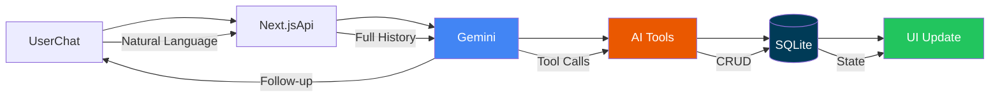
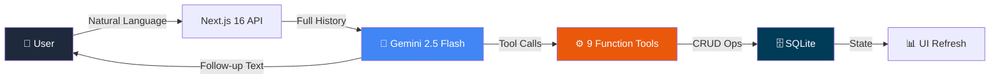

<div align="center">

<!-- HERO SECTION -->
# ⏰ deadClock


### 🚨 Your last-minute deadline safety net powered by autonomous AI agent.

An agentic AI that doesn't just suggest — **it acts**. Plans your tasks, prioritizes by urgency, breaks down goals, and proactively warns you before deadlines hit.

[🚀 Live Demo](https://deadclock.vercel.app) • [📹 Watch Demo](https://youtu.be) • [📦 Install](#-local-development)

</div>

---

## 🎯 The Problem

Most productivity apps are **passive lists** — they wait for you to organize, prioritize, and panic. When you're drowning in deadlines, opening a todo app and staring at 47 unchecked items only adds to the stress.

**deadClock asks a different question:**
> *What if your productivity app worked for you instead of the other way around?*

---

## ✨ The Solution

**deadClock** is a conversation-first AI productivity companion that actively manages your workload using **function-calling AI agents**. You describe what needs doing in plain English; the AI creates tasks, prioritizes them, breaks down goals into actionable chunks, and surfaces exactly what to work on right now.

Think of it as having a **project manager who never sleeps** inside your browser — one that combines deadlines with judgment, not just calendaring.

---

## 🔥 Key Features

| Category | Features |
|----------|----------|
| **🤖 AI Chat** | Natural language task management via **Gemini 2.5 Flash** function calling with two-turn agent orchestration |
| **📋 Smart Tasks** | Dynamic task cards with priority tiers (Urgent/High/Medium/Low), overdue detection, subtask breakdown, and deadline pills |
| **🎯 Goal Breakdown** | AI autonomously splits long-term goals into proportional weekly tasks with hour estimates and milestone tracking |
| **⚡ Proactive Suggestions** | 5-point AI workload analysis — overdue items, upcoming deadlines, focus-area load checks, at-risk goals, large unbroken tasks |
| **🚨 Risk Detection** | `reschedule_at_risk_tasks` identifies tasks inside a configurable risk window (default: 24h) and proposes realistic new deadlines |
| **📊 Analytics** | Focus trend charts, category breakdown, completion rates, and a GitHub-style 6-week activity heatmap |
| **🔥 Streaks & Gamification** | Consecutive-day tracking, 10 unlockable achievements, lifetime completion counters |
| **⌨️ Command Palette** | Power-user navigation: `Cmd+K` to search, `G,C/G,T/G,G/G,D` vim-style jump shortcuts |
| **📅 Auto-Scheduling** | Greedy 9 AM start time-blocking that handles "2 hours" vs "30 mins" intelligently |
| **🌙 Reflection** | End-of-day guided journal with mood selector and focus-forward question prompts |
| **🎨 Premium UX** | Framer Motion animations, dark mode, collapsible sidebar, custom design tokens, 6-tiered hover system |

---

## 🧠 AI Architecture

<div align="center">





</div>

### How the Agent Thinks

```
┌─────────────────────────────────────────────────────────────┐
│  1. User Types → "I need to finish my thesis by Friday"      │
│  2. deadClock detects urgency + deadline                     │
│  3. AI calls add_task (priority: urgent)                     │
│  4. AI calls break_down_goal (weeks remaining, milestones)   │
│  5. AI calls suggest_schedule (time-blocked plan)            │
│  6. AI calls get_reminders (timeframe: today)                │
│  7. streaks + achievements unlock in background              │
│  8. User sees: prioritized tasks, schedule, glory ☕          │
└─────────────────────────────────────────────────────────────┘
```

### The 9 AI Function Tools

| Tool | What It Does |
|------|--------------|
| `add_task` | Creates tasks with ID, priority, deadline, category, subtasks |
| `prioritize_tasks` | Stable-sorts pending → by urgency → completed sinks to bottom |
| `complete_task` | Marks done; triggers streak+achievement checks |
| `add_goal` | Creates long-term goals with milestone tracking |
| `suggest_schedule` | 2-hour time-blocked daily plan from 9 AM |
| `get_reminders` | Surfaces urgent/overdue/today/tomorrow/this-week items |
| `suggest_proactive_actions` | 5-point workload analysis (overdue, upcoming, focus, goals, large tasks) |
| `break_down_goal` | Splits goals into proportional weekly tasks with deadline distribution |
| `reschedule_at_risk_tasks` | Identifies tasks inside configurable risk window, proposes buffer-extended deadlines |

---

## 🎨 Feature Deep-Dives

### AI Chat
A full conversational interface with efficient history management. Includes a **ToolExecutionIndicator** that cycles through contextual status messages ("Organising your tasks…", "Building your schedule…") while the AI thinks, giving the app a living, executive-presence feel. Chat history is capped at 100 messages in the SQLite store.

### Proactive Suggestions
The **`suggest_proactive_actions`** tool is deadClock's secret weapon — it doesn't wait for you to ask. It runs 5 parallel analysis passes: overdue check, upcoming deadline window, focus-area load balancing, least-progressed open goal, and large unbroken tasks needing subtask breakdown. Timeframe enum (`today`/`tomorrow`/`this_week`) + optional `focusArea` enum (`work`/`study`/`health`/`personal`) make it context-aware without repetition.

### Goal Breakdown
`break_down_goal` takes a goal title and: validates milestones exist → calculates weeks remaining → distributes milestone deadlines proportionally across the timeline → auto-creates individual tasks with estimated hours per milestone. Fully autonomous from a single user command.

### Streaks & Gamification
10 unlockable achievements trigger on first task, 5/10 tasks/day milestones, 3/7/14/30-day streak landmarks, first goal set, 50% goal progress, and full goal completion. Uses `INSERT OR IGNORE` so each badge fires exactly once. Current/longest/global stats tracked in a singleton `user_stats` table.

### Activity Heatmap
A **GitHub-style contribution grid** — 6 weeks × 7 days, Monday-start columns, month labels, color-intensity coding (0 tasks → border, 1 → 30% green, 2–3 → 50%, 4+ → full green), CSS-only hover tooltips showing date + task count + focus minutes, future dates rendered as transparent, staggered spring entrance animation with per-cell `scale` and `opacity` stagger.

### Command Palette
Press **`Cmd/Ctrl + K`** to search all views and actions instantly. Supports **vim-style chord shortcuts** (`G, C` → Chat, `G, T` → Tasks, `G, G` → Goals, `G, D` → Dashboard), fuzzy filtering, keyboard navigation (↑↓ + Enter), and dark animated backdrop blur.

---

## 🛠️ Tech Stack

| Layer | Technology | Version |
|-------|-----------|---------|
| **Framework** | Next.js | 16.2.9 (Turbopack) |
| **Language** | TypeScript + React 19 | TS 5 / React 19.2.4 |
| **AI Engine** | Google Gemini (GenAI SDK) | `@google/genai` 2.10 / `gemini-2.5-flash` |
| **Database** | SQLite (`better-sqlite3`) | 12.11.1 |
| **Styling** | Tailwind CSS v4 | `@tailwindcss/postcss` |
| **Animations** | Framer Motion | 12.42.0 |
| **UI Primitives** | shadcn/ui + Base UI | 4.12 / 1.6.0 |
| **Icons** | Lucide React | 1.21.0 |
| **Font** | Geist | Variable |

---

## 🏗️ Project Structure

```
deadClock/
├── app/
│   ├── api/
│   │   ├── chat/route.ts          # POST (AI chat) + GET (state snapshot)
│   │   ├── complete/route.ts      # POST task completion + streak trigger
│   │   ├── analytics/route.ts     # GET heatmap, streaks, daily logs
│   │   └── reflection/route.ts    # POST+GET journal entries
│   ├── layout.tsx                 # Geist font, SEO, root shell
│   └── page.tsx                   # SPA controller + 8 view router
├── components/
│   ├── layout/
│   │   ├── app-shell.tsx          # Responsive frame: sidebar overlay + navbar
│   │   └── sidebar.tsx            # Collapsible nav, brand, user panel
│   ├── chat/chat-view.tsx         # AI chat, tool indicators, input bar
│   ├── tasks/tasks-view.tsx       # Filterable task cards + priority badges
│   ├── goals/goals-view.tsx       # Expandable goals + milestone checklists
│   ├── dashboard/
│   │   └── dashboard-overview.tsx # Stat grid, focus card, insights, urgent panel
│   ├── views/
│   │   ├── analytics-view.tsx     # Focus trend, category breakdown, completion rate
│   │   ├── heatmap-view.tsx       # 6-week GitHub-style contribution grid
│   │   ├── reflection-view.tsx    # Guided journal + mood selector
│   │   └── settings-view.tsx      # Dark mode, shortcuts, about
│   └── shared/
│       ├── command-palette.tsx    # Cmd+K palette + keyboard navigation
│       ├── insight-card.tsx       # 4-variant insight cards + deriveInsights()
│       ├── loading-skeleton.tsx   # 4 shimmer variants
│       ├── empty-state.tsx        # Floating-icon animated placeholders
│       └── priority-badge.tsx      # 4-tier priority badges + category icons
├── lib/
│   ├── agent.ts                   # AI agent: tools, orchestrator, two-turn flow
│   ├── db.js                      # SQLite schema (6 tables), CRUD, streak logic
│   ├── helpers.ts                 # Sort, format, deadline utilities
│   ├── types.ts                   # Canonical View type
│   └── utils.ts                   # cn() + 6-tier hover CSS constants
├── app/
│   └── globals.css                # 50+ design tokens, 9 animations, dark mode
└── package.json
```

---

## 💻 Local Development

<details>
<summary><b>Click to expand setup instructions</b></summary>

### Prerequisites
- Node.js 18+
- A [Google Gemini API key](https://aistudio.google.com/app/apikey)

### Quick Start

```bash
# 1. Clone the repo
git clone https://github.com/itsdivyanshuno/deadClock.git
cd deadClock

# 2. Install dependencies
npm install

# 3. Add your Gemini API key
cp .env.local.example .env.local # paste in your key

# 4. Start the dev server
npm run dev
```

Open **http://localhost:3000** and try:

> *"I have an exam on Friday, a presentation tomorrow, and three assignments pending. Help me plan."*

### Roadmap
```
[ ] Multi-user auth
[ ] Team workspaces  
[ ] Webhook notifications
[ ] Calendar sync (Google/Outlook)
[ ] Focus timer with Pomodoro
[ ] Cloud sync option
[ ] Mobile app (React Native)
```

---

## 🧩 What Makes deadClock Different (Not Another Todo App)

| | deadClock | Traditional Todo Apps |
|---|---|---|
| **Intelligence** | Autonomously creates + manages tasks via function calling | Manually entered, never acted upon |
| **Proactive vs Reactive** | Surfaces risk, overdue, focus imbalances without being asked | Waits for user to discover problems |
| **Agentic Depth** | Two-turn tool execution with state mutation | Simple CRUD at best |
| **Goal Breakdown** | AI decomposes goals into proportional weekly work plans | Flat task list, goals as decoration |
| **Deadline Awareness** | Configurable risk window with proposed rescheduling | Static deadline field |
| **Contextual Analysis** | 5-pass workload analysis (overdue, upcoming, focus, goals, size) | None |

**deadClock isn't a task manager. It's an AI project manager that happens to be free and run in your browser.**

---


## 🚀 Performance & Quality

- **Local-first architecture** with atomic SQLite transactions — no server round-trips for reads
- **Server components + client interactivity** split via Next.js 16 App Router
- **Framer Motion** layout animations with spring physics for butter-smooth transitions
- **Design tokens** (50+ CSS custom properties) enabling instant dark mode + consistent theming
- **Accessibility**: semantic HTML, `aria-label` patterns, visible focus rings, `:focus-visible` states
- **Fully responsive**: mobile hamburger overlay, desktop collapsible sidebar, fluid grids
- **Type-safe** TypeScript 5 strict mode throughout — no `any` escapes in public APIs
- **9 custom keyframe animations** + `tw-animate-css` for polished micro-interactions

---

## 🏆 Why deadClock deserves to win

### 🤖 Agentic AI, not chatbot theater
Most "AI productivity" apps prompt a model, display the response, and call it a day. deadClock gives Gemini **9 real function-calling tools** — it doesn't suggest, it *executes*: creating tasks, mutating state, running priority sorts, and persisting to SQLite — all in a two-turn orchestration loop. This is a **software agent**, not a text generator in a productivity costume.

### 😤 User experience that earns daily use
Every interaction has intentional animation (spring-physics layout transitions, staggered cell entrances in the heatmap, cycling tool-execution indicators, collapsible sidebar tooltips). The command palette rivals VS Code in accessibility to power users. This isn't a hackathon mockup that falls apart at cursor-2 — this is a product.

### 🔬 Technical depth judges will respect
- **Atomic SQLite state management** — wipe-and-reinsert transaction pattern with `ON CONFLICT` upserts
- **Two-turn agent pattern** — prompt → function calls → execution → human-readable follow-up
- **Client-side insight engine** (`deriveInsights`) — zero LLM calls, pure O(n) state analysis
- **6-tiered hover system** — documented interaction hierarchy with distinct feels per element class
- **Design system depth** — 50+ CSS custom properties, dark mode via token inversion, custom scrollbars, animated skeleton loaders

### 🌍 Real-world usefulness, not toy metrics
Gamification tracks genuine productivity signals (streak consistency, category breakdown in daily logs). The reflection system turns ephemeral awareness into saved data. The `reschedule_at_risk_tasks` tool solves the exact problem that makes deadlines stressful — not being warned until it's too late.

### 📈 Built to scale
Current SQLite-backed state is a natural fit for future enhancements: multi-user auth, cloud sync (Prisma → Postgres migration is the natural evolution), WebSocket real-time updates for team contexts, and pluggable AI provider abstraction for multi-model routing.

---

<div align="center">

### 🚀 Built with ❤️ using Next.js 16, Gemini, and a lot of coffee.

[⬆ Back to top](#-deadclock)

</div>
