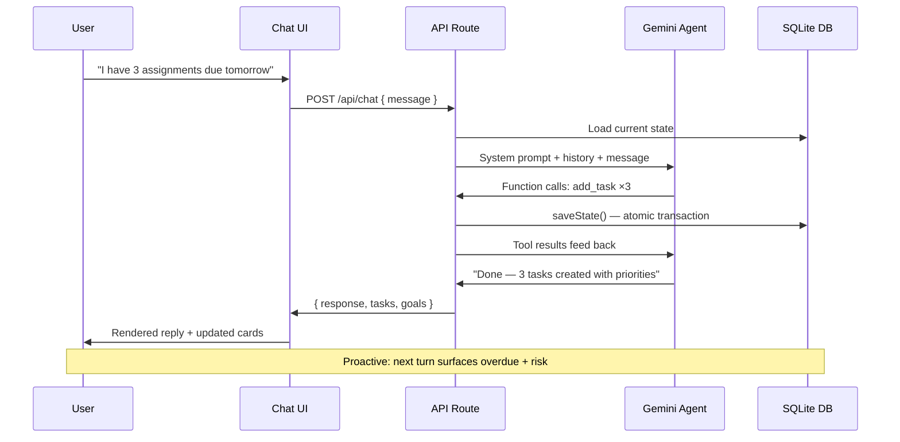
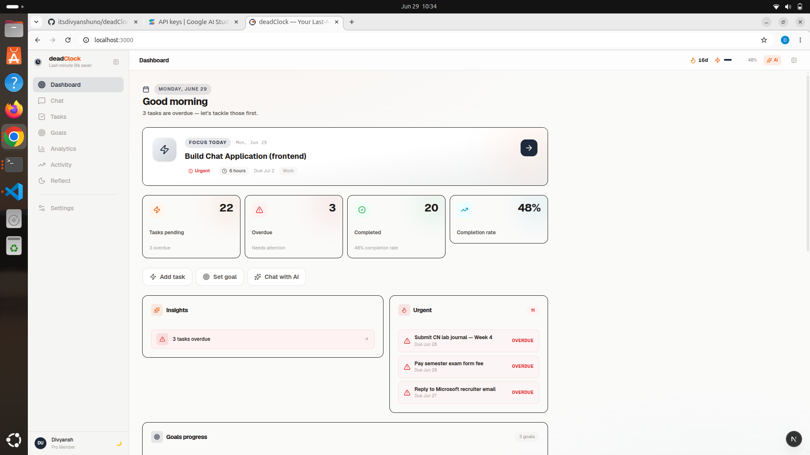
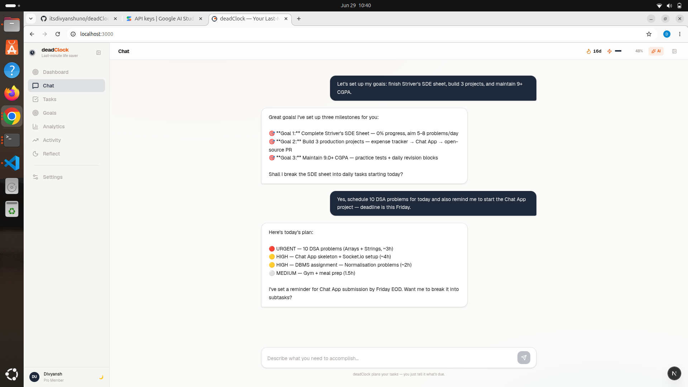
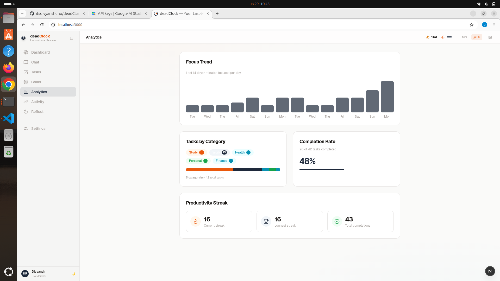
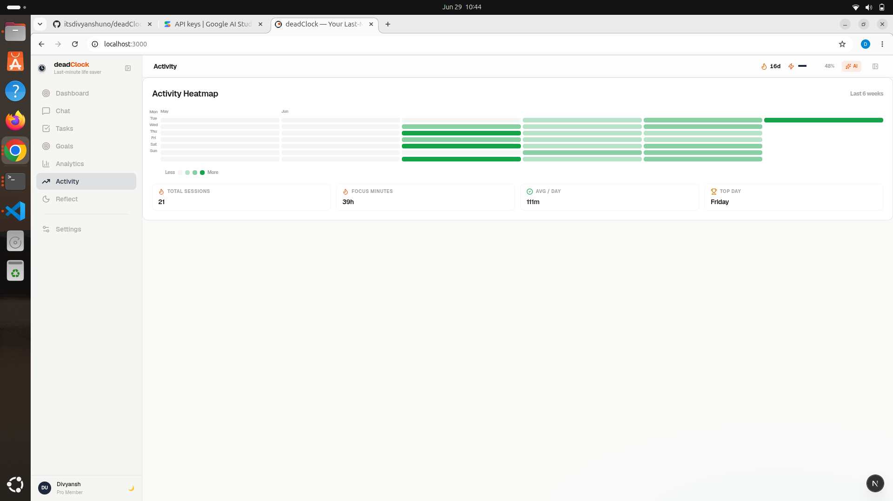
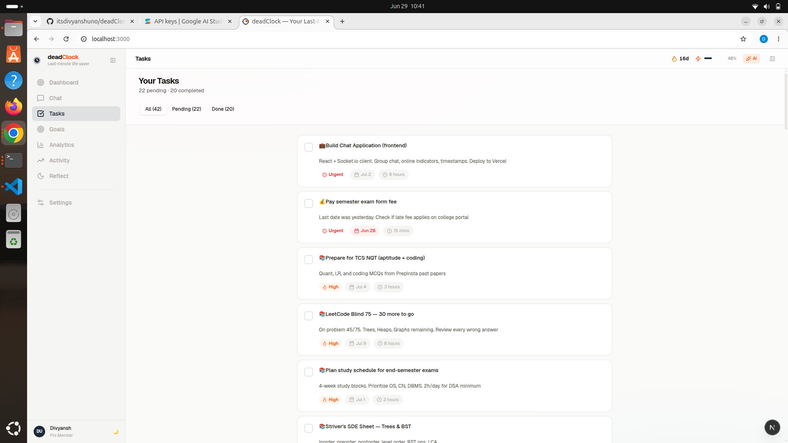
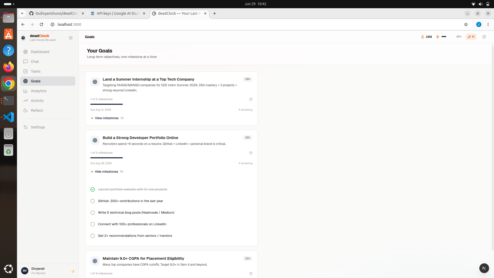

<div align="center">

# deadClock


### Your last-minute deadline safety net, powered by an autonomous AI agent.

An agentic AI that **doesn't just suggest — it acts**. Chat naturally and watch it plan, prioritize, break down goals, and warn you before deadlines hit.

[Demo Video](#) · [Live](https://deadclock.vercel.app) · [Report](https://github.com/itsdivyanshuno/deadClock)

</div>

---

## The Problem

**Productivity apps are passive lists that wait for you to panic.** Most task managers give you an empty box and call it "planning."

When you're drowning in deadlines, staring at 47 unchecked items only adds stress — it doesn't remove it.
You still have to organize, prioritize, and *remember*.

> **deadClock asks a different question: what if your productivity app worked *for* you, not the other way around?**

---

## The Solution

**deadClock** is a conversation-first AI agent that actively manages your workload using **Google Gemini function calling**.

```
You:  "I have a thesis Friday, a presentation tomorrow, and 3 reports due."
deadClock: Creates tasks → prioritizes by urgency → generates a time-blocked schedule
           → breaks down long-term goals → warns about at-risk deadlines → Done.
```

No forms. No manual sorting. No "workspace setup." Just chat.

<div align="center">


</div>

---

## Head-to-Head

<div align="center">

| | **deadClock** | Traditional Todo Apps |
|---|---|---|
| 🧠 **Intelligence** | Creates + manages tasks via function calling | Manual entry, no action |
| ⚡ **Proactive** | Surfaces risk **before** you ask | Waits for you to panic |
| 🎯 **Agentic depth** | Two-turn orchestration + real state mutation | Simple CRUD |
| 🔬 **Technical depth** | Atomic SQLite, deriveInsights engine, 9 tools | Forms → list |
| 😤 **UX craft** | Spring animations, command palette, dark mode | Static UI |
| 🌍 **Usefulness** | Solves actual deadline stress | Toy metrics |

</div>

**deadClock isn't a task manager. It's an AI project manager that runs in your browser for free.**

---

## Key Features

| Icon | Feature | Details |
|------|---------|---------|
| 💬 **Chat** | Natural language task management | Gemini `gemini-2.5-flash` with function calling |
| 📋 **Tasks** | Smart task cards | Priority tiers, overdue detection, subtasks, categories, deadline pills |
| 🎯 **Goals** | Long-term milestones | Progress tracking, expandable checklists, AI-powered goal breakdown |
| ⚡ **Proactive AI** | Autonomous workload analysis | 5-pass engine: overdue → upcoming → focus → at-risk goals → large task scan |
| 🚨 **Risk Detection** | Deadline safety window | Configurable risk window (default 24h) with buffer-extended proposals |
| 📅 **Scheduling** | Auto time-blocking | Greedy 9 AM daily plan, respects "30 mins" vs "2 hours" estimates |
| 🔥 **Gamification** | Streaks + achievements | 10 unlockable badges, streak tracking, lifetime stats, GitHub-style heatmap |
| ⌨️ **Cmd+K** | Power-user navigation | Vim-style shortcuts, fuzzy search, keyboard-native |
| 🌙 **Reflection** | End-of-day journal | 3 guided questions + mood selector persisted to SQLite |
| 🌙 **Dark Mode** | Persistent theme | localStorage-backed, instant toggle, full token inversion |
| 📊 **Analytics** | Activity insights | Focus trend bars, category breakdown, completion rate, productive day |
| ⌨️ **Heatmap** | GitHub-style grid | 6-week contribution grid showing daily completion activity |
| 🎨 **Premium UX** | Buttery interactions | Framer Motion, 6-tiered hover system, collapsible sidebar |
| ⚙️ **9 AI Tools** | Full function-calling agent | add_task, prioritize, complete, schedule, reminders, goal breakdown, risk detection |

### All 9 AI Function Tools

| Tool | What it does |
|------|-------------|
| `add_task` | Creates tasks with ID, priority, deadline, category, subtasks |
| `prioritize_tasks` | Stable-sorts: pending first → by urgency → completed sinks |
| `complete_task` | Marks done + triggers streak + achievement checks |
| `add_goal` | Creates long-term goal with milestone tracking |
| `suggest_schedule` | 2-hour time-blocked daily plan starting 9 AM |
| `get_reminders` | Surfaces urgent / overdue / today / tomorrow / this-week |
| `suggest_proactive_actions` | 5-pass workload analysis (overdue, upcoming, focus, goals, large tasks) |
| `break_down_goal` | Splits goals → proportional weekly tasks with deadline distribution |
| `reschedule_at_risk_tasks` | Identifies tasks inside risk window, proposes extended deadlines |

---

## Tech Stack

| Layer | Technology |
|-------|-----------|
| **Framework** | Next.js 16 + Turbopack (App Router, Server Components) |
| **Language** | TypeScript 5 + React 19 |
| **AI Engine** | Google Gemini (`@google/genai` 2.10, `gemini-2.5-flash`) |
| **Database** | SQLite via `better-sqlite3` (6 tables, atomic transactions) |
| **Styling** | Tailwind CSS v4 (`@tailwindcss/postcss`) |
| **Animations** | Framer Motion 12 |
| **UI Primitives** | shadcn/ui + Base UI (Radix under the hood) |
| **Icons** | Lucide React |
| **Font** | Geist (variable) |

---

## How It Works

<div align="center">



</div>

1. **User chats naturally** — no forms, no syntax to learn
2. **Gemini decides to act** — function calling triggers the right tool
3. **Tools mutate real state** — atomic SQLite transactions, no partial writes
4. **UI updates instantly** — live task cards, streak counters, heatmap cells
5. **Proactive follow-ups** — the agent surfaces risks unprompted on the next turn

---

## Project Structure

```
deadClock/
├── app/
│   ├── api/
│   │   ├── chat/         ← POST AI chat + GET state snapshot
│   │   ├── complete/     ← POST task completion + streak trigger
│   │   ├── analytics/    ← GET heatmap, streaks, daily logs
│   │   └── reflection/   ← POST + GET journal entries
│   ├── layout.tsx        ← Geist font, SEO, root shell
│   └── page.tsx          ← SPA controller + 8-view router
├── components/
│   ├── layout/
│   │   ├── app-shell.tsx ← Responsive frame, sidebar, navbar
│   │   └── sidebar.tsx   ← Collapsible nav, brand header
│   ├── chat/             ← AI conversation, typing + tool indicators
│   ├── tasks/            ← Filterable cards, priority badges, overdue styling
│   ├── goals/            ← Expandable goals, milestone checklists
│   ├── dashboard/        ← Stat grid, focus card, insights, urgent panel
│   ├── views/
│   │   ├── analytics/    ← Focus trend, category breakdown, completion rate
│   │   ├── heatmap/      ← 6-week GitHub-style contribution grid
│   │   ├── reflection/   ← Guided journal + mood selector
│   │   └── settings/     ← Dark mode, shortcuts, about
│   └── shared/
│       ├── command-palette  ← Cmd+K search, vim-style navigation
│       ├── insight-card     ← 4 variants + deriveInsights() engine
│       ├── loading-skeleton ← 4 variants with staggered shimmer
│       └── empty-state      ← Animated floating-icon placeholders
├── lib/
│   ├── agent.ts          ← AI agent: 9 tools, orchestrator, two-turn loop
│   ├── db.js             ← SQLite: 6 tables, CRUD, streaks, achievements
│   ├── helpers.ts        ← Sort, format, deadline utilities
│   ├── types.ts          ← Canonical View type
│   └── utils.ts          ← cn() + 6-tier hover system
└── scripts/
    ├── seed-dummy-data.js         ← Professional persona seed
    └── seed-student-dummy-data.js ← Student persona (42 tasks, 3 goals, 21-day analytics)
```

---

## Local Development

```bash
# 1. Clone
git clone https://github.com/itsdivyanshuno/deadClock.git
cd deadClock

# 2. Install
npm install

# 3. Add your Gemini API key (get one free at https://aistudio.google.com)
cp .env.local.example .env.local
# paste in: GEMINI_API_KEY=your_key

# 4. Optional: seed with demo data
node scripts/seed-student-dummy-data.js   # student persona (42 tasks, 3 goals)
node scripts/seed-dummy-data.js            # professional persona (13 tasks, 2 goals)

# 5. Dev server (Turbopack)
npm run dev
```

Open **http://localhost:3000**

> *"I have an exam Friday, a presentation tomorrow, and three assignments due. Help me plan."*

### Scripts

| `npm run` | Does |
|-----------|------|
| `dev` | Turbopack dev server |
| `build` | Production build (server-only runtime) |
| `lint` | ESLint |
| `start` | Production server |

---

## Keyboard Shortcuts

| Keys | Action |
|------|--------|
| `Cmd` / `Ctrl` + `K` | Open command palette |
| `Esc` | Close modal / palette |
| `G` then `C` | Go to Chat |
| `G` then `T` | Go to Tasks |
| `G` then `G` | Go to Goals |
| `G` then `D` | Go to Dashboard |
| `G` then `A` | Go to Analytics |
| `G` then `H` | Go to Activity Heatmap |
| `Enter` | Send message |
| `Shift` + `Enter` | New line in input |
| `Cmd` / `Ctrl` + `,` | Settings |

---

## Screenshots

| Dashboard | Chat |
|-----------|------|
| ** | ** |

| Analytics | Heatmap | Tasks | Goals |
|-----------|---------|-------|-------|
| ** | ** | ** | ** |

---

## Technical Differentiators

- **Atomic SQLite transactions** — wipe-and-reinsert with `ON CONFLICT` upserts; the DB is always a consistent snapshot
- **Two-turn agent loop** — user message → function calls → in-memory execution → human-readable follow-up
- **`deriveInsights()` engine** — zero LLM calls, pure O(n) state analysis, 4 visual variants (danger / warning / info / success)
- **6-tiered hover system** — documented interaction hierarchy, distinct feel per element class
- **50+ CSS design tokens** — instant dark mode via token inversion, custom scrollbars, animated skeletons
- **21-day analytics backfill** — realistic seed script generates consecutive daily_logs with rest days, correct streaks and focus minutes
- **Type-safe** TypeScript 5 strict mode — `any` isolated to CJS `lib/db.js` boundary only

---

## Architecture Highlights

### State Flow

```
Chat message → POST /api/chat → agent.ts chat()
  → loadState() from SQLite
  → build Gemini request with system prompt + history + tools
  ← Gemini returns text + function calls
  → execute tools (mutate in-memory state)
  → saveState() (atomic: wipe + reinsert via transaction)
  → return { response, tasks, goals }

Every state mutation flows through the agent.
The client never touches the DB directly.
```

### Database Schema

| Table | Purpose |
|-------|---------|
| `tasks` | All tasks with priority, status, category, subtasks, completedAt |
| `goals` | Long-term goals with JSON milestone arrays |
| `chatHistory` | Full conversation (capped at last 100 messages) |
| `daily_logs` | Per-day analytics: tasksCompleted, focusMinutes, category breakdown |
| `user_stats` | Singleton row: currentStreak, longestStreak, totalCompletions |
| `achievements` | Unlocked badges (INSERT OR IGNORE) |

---

## Roadmap

```text
[x] Conversation-first AI task management
[x] 9 function-calling tools with two-turn orchestration
[x] Proactive workload analysis + risk detection
[x] Goal breakdown with proportional scheduling
[x] Gamification (streaks, 10 achievements)
[x] GitHub-style 6-week activity heatmap
[x] End-of-day reflection journal
[x] Command palette with vim-style shortcuts
[x] Dark mode + premium animations
[x] Realistic seed data (21-day analytics backfill)
[ ] Multi-user auth + cloud sync (Supabase / Firebase)
[ ] Team workspaces
[ ] Calendar sync (Google Calendar / Outlook)
[ ] Pomodoro focus timer (live tracking → analytics)
[ ] Mobile app (React Native)
```

---

## License

MIT — built with 💀 for Vibe2Ship

[⬆ Back to top](#-deadclock)

</div>
