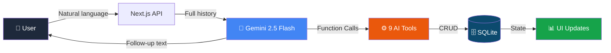

<div align="center">

<!-- HERO -->
# ⏰ deadClock


### Your last-minute deadline safety net, powered by an autonomous AI agent.

An agentic AI that **doesn't just suggest — it acts**.
Chat naturally. It plans, prioritizes, breaks down goals, and warns you before deadlines hit.

[🚀 Live Demo](https://deadclock.vercel.app) · [▶ Watch Demo Video](https://youtu.be) · [📄 Report](https://github.com/itsdivyanshuno/deadClock)

</div>

---

## 🎯 The Problem

**Productivity apps are passive lists that wait for you to panic.**

Most task managers give you an empty box and call it "planning."
When you're drowning in deadlines, staring at 47 unchecked items only adds stress — it doesn't remove it. You still have to organize, prioritize, and *remember*.

**deadClock asks a different question:**
> *"What if your productivity app worked **for** you, not the other way around?"*

---

## ✨ The Solution

**deadClock** is a conversation-first AI agent that actively manages your workload using **function-calling AI**.

```
You: "I have a thesis Friday, a presentation tomorrow, and 3 reports due."
deadClock: Creates tasks → prioritizes by urgency → generates a time-blocked schedule
           → breaks down long-term goals → warns about at-risk deadlines → Done.
```

No forms. No manual sorting. No "workspace setup." Just chat.

<div align="center">



</div>

---

## 🏆 Why deadClock Wins

<div align="center">

| | deadClock | Todo Apps |
|---|---|---|
| 🧠 **Intelligence** | Creates + manages tasks via function calling | Manual entry, no action |
| ⚡ **Proactive** | Surfaces risk **before** you ask | Waits for you to panic |
| 🎯 **Agentic depth** | Two-turn orchestration + real state mutation | Simple CRUD |
| 🔬 **Technical depth** | Atomic SQLite, deriveInsights engine, 9 tools | Forms → list |
| 😤 **UX craft** | Spring animations, command palette, dark mode | Static UI |
| 🌍 **Usefulness** | Solves actual deadlines stress | Toy metrics |

</div>

**deadClock isn't a task manager. It's an AI project manager that runs in your browser for free.**

---

## 🔥 Key Features

| Icon | Category | Key capability |
|---|---|---|
| 💬 **Chat** | Natural language task management | Gemini `gemini-2.5-flash` with function calling |
| 📋 **Tasks** | Smart task cards | Priority tiers, overdue detection, subtasks, deadline pills |
| 🎯 **Goals** | Long-term milestones | Progress tracking, expandable checklists, goal breakdown |
| ⚡ **Proactive AI** | Autonomous workload analysis | 5-pass: overdue, upcoming, focus area, at-risk goals, large tasks |
| 🚨 **Risk** | Deadline safety window | Configurable risk window (default 24h) with buffer-extended proposals |
| 📅 **Scheduling** | Auto time-blocking | Greedy 9 AM daily plan, handles "30 mins" vs "2 hours" |
| 🔥 **Gamification** | Streaks + achievements | 10 unlockable badges, streak tracking, lifetime stats |
| ⌨️ **Cmd+K** | Power-user navigation | Vim-style shortcuts, fuzzy search, keyboard-native |
| 🌙 **Reflection** | End-of-day journal | 3 questions + mood selector persisted to SQLite |
| 📊 **Analytics** | GitHub-style heatmap | 6-week contribution grid with staggered spring animation |
| 🎨 **Premium UX** | Buttery interactions | Framer Motion, 6-tiered hover system, dark mode, collapsible sidebar |

<details>
<summary><b>▶ All 9 AI Function Tools (click to expand)</b></summary>

| Tool | What it does |
|---|---|
| `add_task` | Creates tasks with ID, priority, deadline, category, subtasks |
| `prioritize_tasks` | Stable-sorts: pending first → by urgency → completed sinks |
| `complete_task` | Marks done + triggers streak + achievement checks |
| `add_goal` | Creates long-term goal with milestone tracking |
| `suggest_schedule` | 2-hour time-blocked daily plan starting 9 AM |
| `get_reminders` | Surfaces urgent / overdue / today / tomorrow / this-week |
| `suggest_proactive_actions` | 5-pass workload analysis (overdue, upcoming, focus, goals, large tasks) |
| `break_down_goal` | Splits goals → proportional weekly tasks with deadline distribution |
| `reschedule_at_risk_tasks` | Identifies tasks inside risk window, proposes extended deadlines |

</details>

---

## 🛠️ Tech Stack

| Layer | Technology | Version |
|---|---|---|
| **Framework** | Next.js | 16.2.9 (Turbopack) |
| **Language** | TypeScript + React 19 | TS 5 / React 19.2.4 |
| **AI Engine** | Google Gemini | `@google/genai` 2.10 / `gemini-2.5-flash` |
| **Database** | SQLite (`better-sqlite3`) | 12.11.1 |
| **Styling** | Tailwind CSS v4 | `@tailwindcss/postcss` |
| **Animations** | Framer Motion | 12.42.0 |
| **UI Primitives** | shadcn/ui + Base UI | 4.12 / 1.6.0 |
| **Icons** | Lucide React | 1.21.0 |
| **Font** | Geist | Variable |

---

## 🏗️ Project Structure

```
deadClock/
├── app/
│   ├── api/
│   │   ├── chat/          ← POST AI chat + GET state snapshot
│   │   ├── complete/      ← POST task completion + streak trigger
│   │   ├── analytics/     ← GET heatmap, streaks, daily logs
│   │   └── reflection/    ← POST + GET journal entries
│   ├── layout.tsx         ← Geist font, SEO, root shell
│   └── page.tsx           ← SPA controller + 8 view router
├── components/
│   ├── layout/
│   │   ├── app-shell.tsx  ← Responsive frame, sidebar, navbar
│   │   └── sidebar.tsx    ← Collapsible nav, brand header, user panel
│   ├── chat/chat-view.tsx ← AI conversation, typing + tool indicators
│   ├── tasks/tasks-view.tsx ← Filterable cards, priority badges, overdue styling
│   ├── goals/goals-view.tsx ← Expandable goals, milestone checklists
│   ├── dashboard/         ← Stat grid, focus card, insights, urgent panel
│   ├── views/
│   │   ├── analytics/     ← Focus trend, category breakdown, completion rate
│   │   ├── heatmap/       ← 6-week GitHub-style contribution grid
│   │   ├── reflection/    ← Guided journal + mood selector
│   │   └── settings/      ← Dark mode, shortcuts reference, about
│   └── shared/
│       ├── command-palette ← Cmd+K search, vim-style navigation
│       ├── insight-card   ← 4-variant cards + deriveInsights() engine
│       ├── loading-skeleton ← 4 variants with staggered shimmer
│       ├── empty-state    ← Animated floating-icon placeholders
│       └── priority-badge  ← 4-tier badges + category emoji map
└── lib/
    ├── agent.ts ← AI agent: 9 tools, orchestrator, two-turn flow
    ├── db.js    ← SQLite: 6 tables, CRUD, streaks, achievements
    ├── helpers.ts ← Sort, format, deadline utilities
    ├── types.ts  ← Canonical View type
    └── utils.ts  ← cn() + 6-tier hover system
```

---

## 💻 Local Development

<details>
<summary><b>Click to expand setup + run instructions</b></summary>

```bash
# 1. Clone
git clone https://github.com/itsdivyanshuno/deadClock.git
cd deadClock

# 2. Install
npm install

# 3. Add your Gemini API key
cp .env.local.example .env.local    # paste in: GEMINI_API_KEY=your_key

# 4. Dev server
npm run dev
```

Open **http://localhost:3000**

Try it:
> *"I have an exam Friday, a presentation tomorrow, and three assignments due. Help me plan."*

---

### Scripts

| `npm run` | Does |
|---|---|
| `dev` | Turbopack dev server |
| `build` | Production build |
| `lint` | ESLint |
| `start` | Production server |

</details>

---

## 🎮 Keyboard Shortcuts

| Keys | Action |
|---|---|
| `Cmd` / `Ctrl` + `K` | Open command palette |
| `Esc` | Close |
| `G` then `C` | Go to Chat |
| `G` then `T` | Go to Tasks |
| `G` then `G` | Go to Goals |
| `G` then `D` | Go to Dashboard |
| `Enter` | Send |
| `Shift` + `Enter` | New line |
| `Cmd` / `Ctrl` + `,` | Settings |

---

## 📸 Screenshots

<!-- Replace with your actual screenshots/videos -->

<div align="center">

| Dashboard | Chat | Analytics |
|---|---|---|
| ** | ** | ** |

| Tasks | Goals | Mobile |
|---|---|---|
| ** | ** | ** |

</div>

---

## 🔬 Technical Differentiators

- **Atomic SQLite transactions** — wipe-and-reinsert with `ON CONFLICT` upserts; the DB is always a consistent snapshot
- **Two-turn agent loop** — prompt → function calls → in-memory execution → human-readable follow-up
- **`deriveInsights()` engine** — zero LLM calls, pure O(n) state analysis, 4 visual variants (danger / warning / info / success)
- **6-tiered hover system** — documented interaction hierarchy, distinct feel per element class
- **50+ CSS design tokens** — instant dark mode via token inversion, custom scrollbars, animated skeletons
- **Type-safe** TypeScript 5 strict mode — `any` kept only for CJS `lib/db.js` boundary

---

## 🗺️ Roadmap

```text
[x] Conversation-first AI task management
[x] 9 function-calling tools with two-turn orchestration
[x] Proactive workload analysis + risk detection
[x] Goal breakdown with proportional scheduling
[x] Gamerification (streaks, 10 achievements)
[x] GitHub-style 6-week activity heatmap
[x] End-of-day reflection journal
[x] Command palette with vim-style shortcuts
[x] Dark mode + premium animations
[ ] Multi-user auth
[ ] Team workspaces
[ ] Calendar sync (Google / Outlook)
[ ] Focus timer (Pomodoro)
[ ] Cloud sync + mobile app
```

---

<div align="center">

### Built with ❤️ for [Vibe2Ship](https://vibe2ship.com)

[⬆ Back to top](#-deadclock)

</div>
